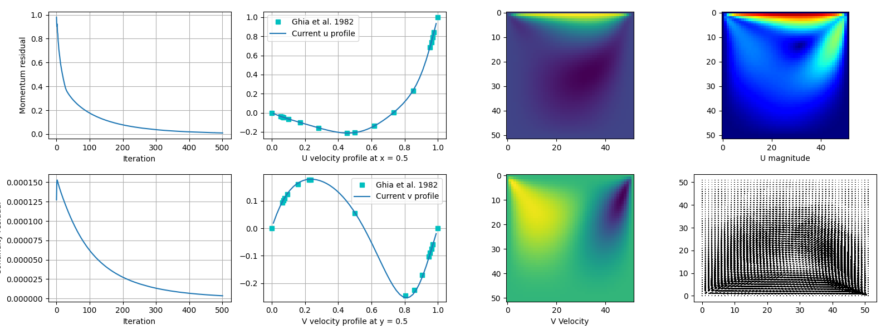

# SIMPLE-taichi
SIMPLE-taichi is an incompressible fluid solver implementing the [SIMPLE method](https://en.wikipedia.org/wiki/SIMPLE_algorithm) written in [Taichi](https://docs.taichi-lang.org/docs). The target flow field is rectangular with typical boundary conditions (inflow/outflow/wall).

## Features
- Finite Volume Method (FVM)
- Built-in Conjugate-Gradient (CG) and BiCGSTAB solver

## Requirement
- Taichi 1.0.0
- Matplotlib

## Demo
As a concrete validation, the computation results of a lid-driven cavity case are compared with the well-know literature values.

## 压力修正法

$$
不可压缩流连续方程离散格式：[(\rho u)_w - (\rho u)_e] \cdot \Delta y + [(\rho v)_s - (\rho v)_n] \cdot \Delta x = b\\

a_W = \rho_e d_e \Delta y = \rho_e {A_e \over a_n} \Delta y = \rho \Delta y \Delta y / a_w
$$

## 求解代数方程

### BICG算法

双共轭梯度求解压力修正的离散方程

### BICGSTAB算法

稳定双共轭梯度求解动量守恒的离散方程

初始化：

迭代：

部分公式：
$$
rho = \bold r^T_k \bold r_k  \\
alpha\_lower = \bold p^T_k \bold A \bold p_k \\
alpha = rho / alpha_lower \\

\bold s = \bold r_k - \alpha_k * \bold A \bold p_k \\

\bold p_{k+1} := \bold r_{k+1} + \beta_k ·(\bold p_k - \omega *\bold A \bold p)  \\
$$
